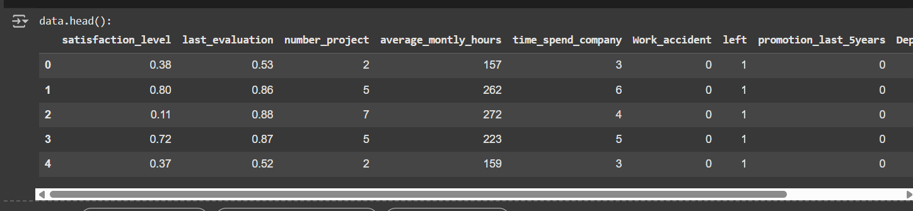
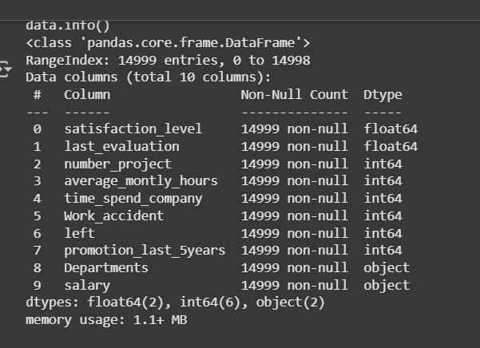
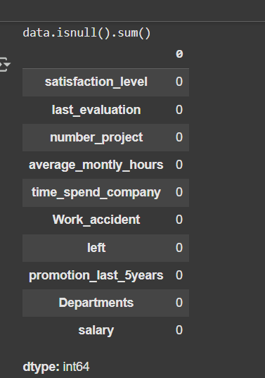
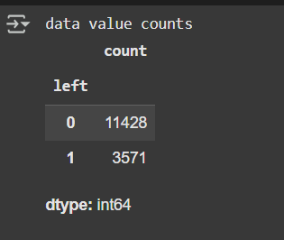
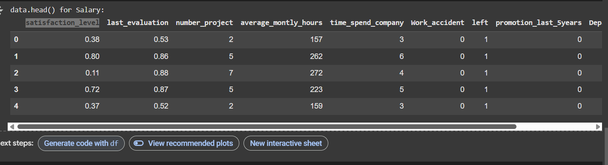
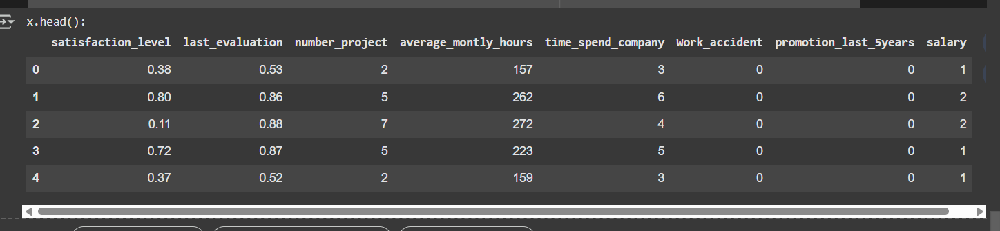
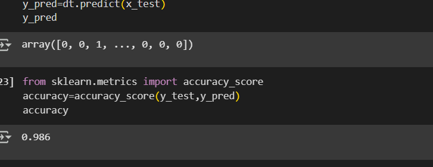
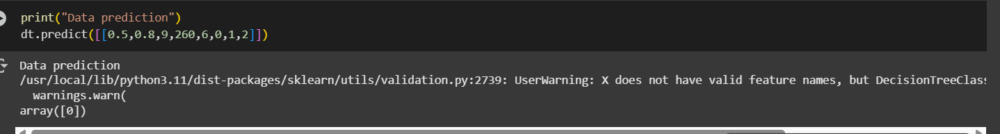
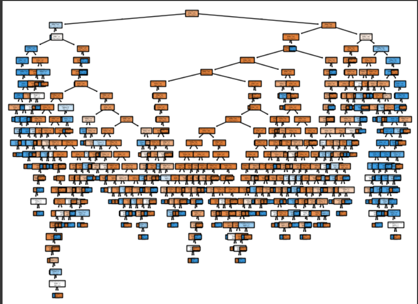

# Implementation-of-Decision-Tree-Classifier-Model-for-Predicting-Employee-Churn

## AIM:
To write a program to implement the Decision Tree Classifier Model for Predicting Employee Churn.

## Equipments Required:
1. Hardware – PCs
2. Anaconda – Python 3.7 Installation / Jupyter notebook

## Algorithm
```
1. Import pandas
2. Import Decision tree classifier
3. Fit the data in the model
4. Find the accuracy score 
```

## Program:
```
/*
Program to implement the Decision Tree Classifier Model for Predicting Employee Churn.
Developed by: PAUL SHERVIN P
RegisterNumber:  212224240111
*/
```
```
import pandas as pd
df=pd.read_csv("/content/Employee.csv")
print("data.head():")
df.head()
```
```
print("data.info()")
df.info()
```
```
print("data.isnull().sum()")
df.isnull().sum()
```
```
print("data value counts")
df["left"].value_counts()
```
```
from sklearn.preprocessing import LabelEncoder
le=LabelEncoder()
print("data.head() for Salary:")
df["salary"]=le.fit_transform(df["salary"])
df.head()
```
```
print("x.head():")
x=df[["satisfaction_level","last_evaluation","number_project","average_montly_hours","time_spend_company","Work_accident","promotion_last_5years","salary"]]
x.head()
```
```
y=df["left"]
from sklearn.model_selection import train_test_split
x_train,x_test,y_train,y_test=train_test_split(x,y,test_size=0.2,random_state=100)
from sklearn.tree import DecisionTreeClassifier
dt=DecisionTreeClassifier(criterion="entropy")
dt.fit(x_train,y_train)
y_pred=dt.predict(x_test)
y_pred
```
```
from sklearn.metrics import accuracy_score
accuracy=accuracy_score(y_test,y_pred)
accuracy
```
```
print("Data prediction")
dt.predict([[0.5,0.8,9,260,6,0,1,2]])
```
```
from sklearn.tree import plot_tree
import matplotlib.pyplot as plt
plt.figure(figsize=(10,10))
plot_tree(dt,filled=True,feature_names=x.columns,class_names=['salary' , 'left'])
plt.show()
```

## Output:










## Result:
Thus the program to implement the  Decision Tree Classifier Model for Predicting Employee Churn is written and verified using python programming.
